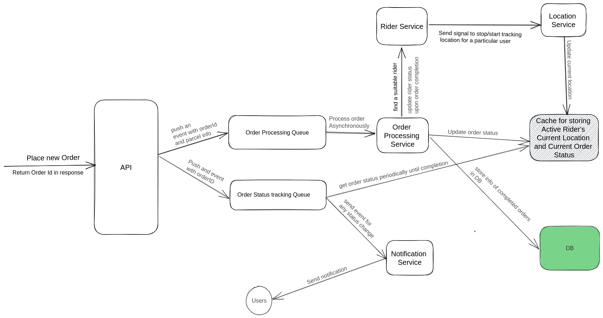
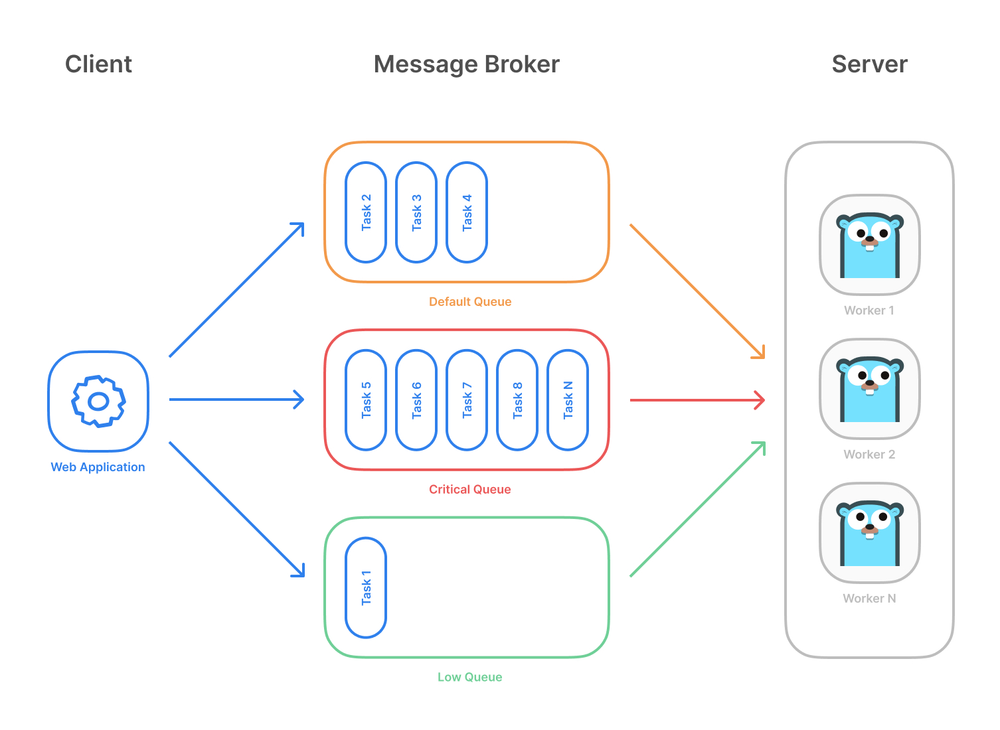

# Parcel-Simulator

## Installing the application
You can run the application by cloning this to your local machine or directly from Docker image.

The following sections will guide you to install the application:

### Run from Docker images

If you want to test the application by only running the Docker containers, you can follow
the steps below:

- Pull Redis Docker image:
```bash
    docker pull redis:7-alpine
```

- Run the Redis image:
```bash
  docker run --name redis --net=host  -d redis:7-alpine
```

- Pull the application image:
```bash
  docker pull piyush1146115/parcel:latest
```

- Run the application image:
```bash
  docker run --name parcel-simulator --net=host -d piyush1146115/parcel:latest
```

### By Cloning the Repository locally

- Clone the repository locally using git
- Change your current directory to the location of the project:
```bash
  cd ./../parcel  
```

- Install the external dependencies like DB:
```bash
  make install-dependencies
```

- Install and run the application:
```bash
    make install
```

This above steps should complete your installation. 

**N.B:** Both of the above process assumes that Docker client is installed on your local machine

## HTTP Requests
Here are some demo request of the server:

### POST requests:

- Place order for customer with ID 11 (Authorized Customer)
```bash
curl localhost:8090/api/v1/parcel/11 -X POST -H "Content-Type: application/json" -d '{"receiver_name":"xyz", "receiver_number":"0131234131", "pickup_latitude":37.7749,"pickup_longitude":-122.4313,"dropoff_latitude":37.7886,"dropoff_longitude":-122.4314}'  
```
Sample response:
`{"order_id":1678341228942000002,"success":true}`

- Place order for customer with ID 16 (Unauthorized)
```bash
curl localhost:8090/api/v1/parcel/16 -X POST -H "Content-Type: application/json" -d '{"receiver_name":"xyz", "receiver_number":"0131234131", "pickup_latitude":37.7749,"pickup_longitude":-122.4313,"dropoff_latitude":37.7886,"dropoff_longitude":-122.4314}' 
```
Sample response:
`No authorized customer found with id: 16`

### Get requests:

- Ping the homepage
```bash
curl localhost:8090
```
Sample response:
`Welcome to the Homepage of parcel simulator!`

- Get the current status of a Rider with ID 5
```bash
    curl localhost:8090/api/v1/rider/status/5
```
Sample response: `{"rider_id":5,"rider_status":"Available"}`

- Get the current status of the order with ID 1678341228942000002 (Valid Order Id)
```bash
curl localhost:8090/api/v1/order/status/1678341228942000002
```
Sample response:
`{"order_id":1678345319223000002,"order_status":"Accepted"}`
`{"order_id":1678345319223000002,"order_status":"Searching Rider"}`

## System Design



### High level system design flow

1. The API will receive a new order request and response with a unique order ID
2. The API will send events to the order processing task queue and Order status tracking queue
3. The Order processing service will process the order requests asynchronously
4. The Order processing service will find a nearest rider for the request based on availability
5. If there is no available rider, then send another requeue event to the order processing task
6. Rider service will send a request to the Location service to track available Riders location
7. The Location service will update the current location to the cache
8. Order Processing service will update the oder status in the cache
9. Order Status Queue will get updated status from the cache periodically
10. Order Status Queue will send event to the notification service
11. The Notification service will send notification to the users


## Implementation details

Here, we are going to look at some implementation details

### Order Processing
- Each New parcel creation API call is responded with a unique order ID based on current timestamp
- The server saves the order ID in orders list and send an event to order processing queue and order status tracking queue
- The order status queue periodically checks for order status by corresponding orderID and check if order completed
- The order processing queue process rest of the tasks related to order and update the records

### How the Queue works

We have implemented a Redis Queue which acts like a message broker. It runs some concurrent workers
to process works concurrently. We have used this queue to track order status, update order status, rider status etc.
In the backend, we used Asynq library. The following image depicts how [Asynq](https://github.com/hibiken/asynq) workers work under the hood.



### How the location and order status update work

In the real world system, there should be separate microservices for updating order status 
and Rider's current location. However, for fast development we stayed in the
monolith approach. We have mock the location update service and order status service with `time.Ticker` and goroutine in Golang.
We have implemented two separate functions those will run concurrently and update Rider's location and order status.

### Database

We have assumed that we already have a set of rider and user information to our
service. Again, for going fast we mocked the database with some in-memory json arrays.
However, we will move into `Postgres` as permanent data storage and `Redis` as cache data
storage in near future. For reference, we have designed a `DB Schema` like the following. 


