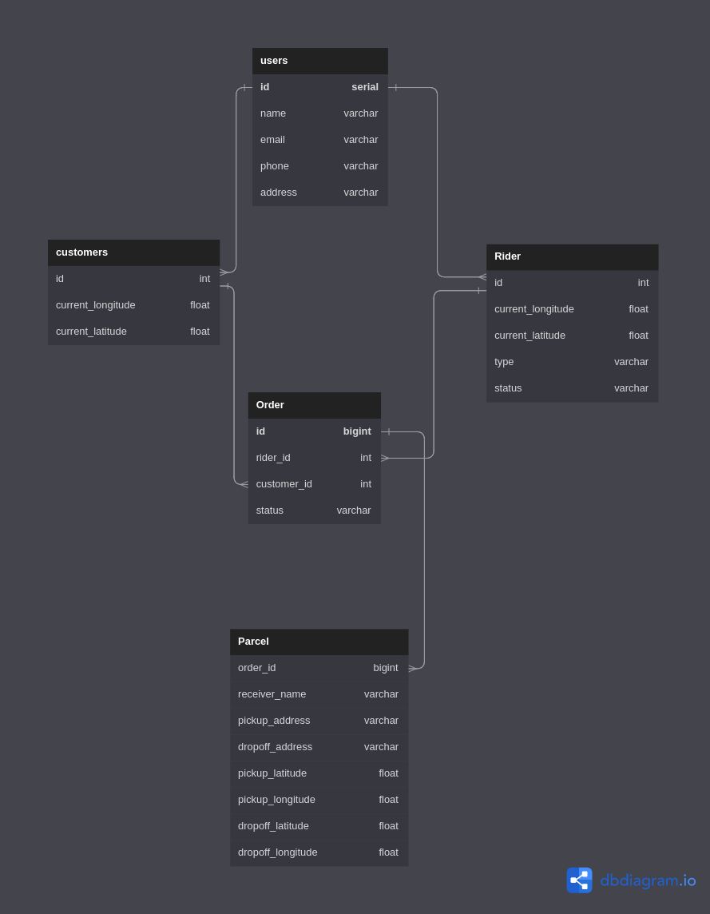
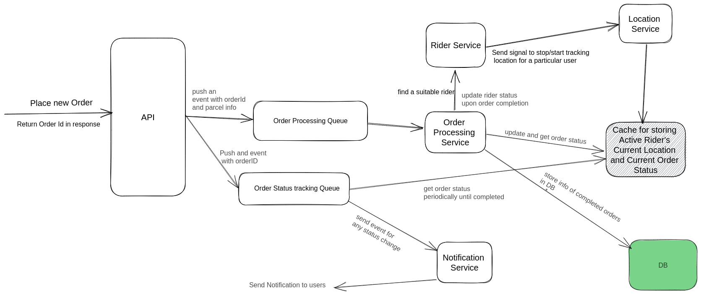

# Parcel-Simulator

## HTTP Requests
Here are some demo request of the server:

### POST requests:

- Place order for customer with ID 11 (Authorized Customer)
```bash
curl localhost:8090/api/v1/parcel/11 -X POST -H "Content-Type: application/json" -d '{"receiver_name":"xyz", "receiver_number":"0131234131", "pickup_latitude":37.7749,"pickup_longitude":-122.4313,"dropoff_latitude":37.7886,"dropoff_longitude":-122.4314}'  
```
Sample response:
`{"order_id":1678341228942000002,"success":true}`

- Place order for customer with ID 16 (Unauthorized)
```bash
curl localhost:8090/api/v1/parcel/16 -X POST -H "Content-Type: application/json" -d '{"receiver_name":"xyz", "receiver_number":"0131234131", "pickup_latitude":37.7749,"pickup_longitude":-122.4313,"dropoff_latitude":37.7886,"dropoff_longitude":-122.4314}' 
```
Sample response:
`No authorized customer found with id: 16`

### Get requests:

- Ping the homepage
```bash
curl localhost:8090
```
Sample response:
`Welcome to the Homepage of parcel simulator!`

- Get the current status of the order with ID 1678341228942000002 (Valid Order Id)
```bash
curl localhost:8090/api/v1/order/status/1678341228942000002
```
Sample response:
`{"order_id":1678345319223000002,"order_status":"Accepted"}`

## DB Schema



## System Design

